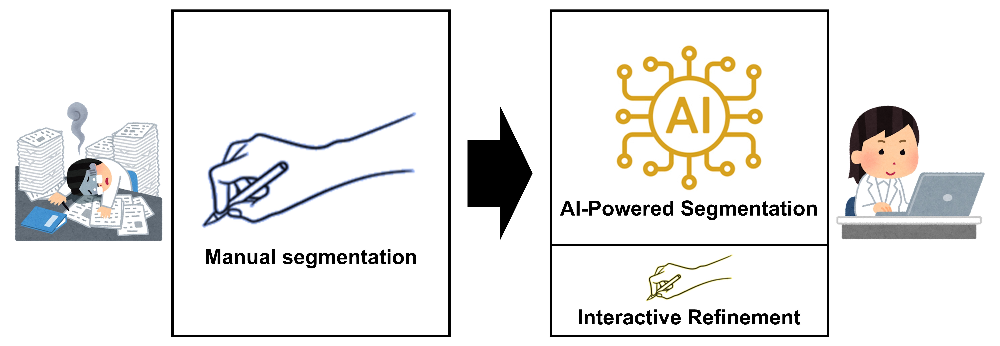
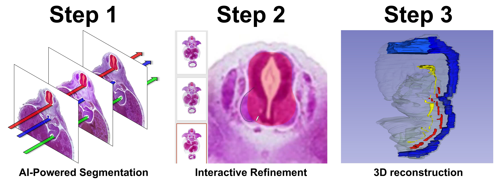
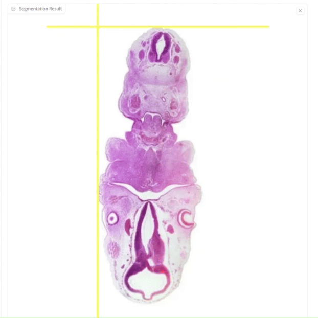
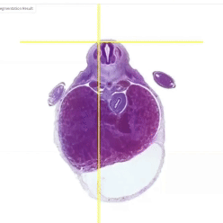

# AI-Powered Segmentation and Interactive Refinement for Labor-Saving 3D Reconstruction  

・連続切片（連続断層画像）に特化した自動セグメンテーションツール  
・組織連続切片、解剖断面、CT、MRI、超音波画像など幅広い画像に対応  
・Segment Anything Model 2 (SAM2)による学習不要の自動セグメンテーション（Zero-shot segmentation）  
・PCの環境構築が必要ないWeb GUI (Graphical User Interface)  
・セグメンテーションマスクの修正ツールでユーザーによる確認・修正が可能  
・3D Slicerへのインポートと迅速な3D再構築に対応  

※組織連続切片ではセグメンテーションの前に位置合わせが必要です。MultiStackRegによる自動位置合わせの方法は[こちら](Registration.md)。  

- Automatic Segmentation Tool Specialized for Serial Sections (Continuous Tomographic Images)  
- Supports a wide range of images, including histological serial sections, anatomical cross-sections, CT, MRI, and ultrasound images.  
- Zero-shot segmentation using the Segment Anything Model 2 (SAM2), eliminating the need for training.  
- Web-based GUI (Graphical User Interface) that does not require PC environment setup.  
- Allows users to review and edit segmentation masks with a correction tool.  
- Supports import into 3D Slicer for rapid 3D reconstruction.  

Note: For histological serial sections, registration (alignment) is required before segmentation. See [this page](Registration.md) for the method of automatic alignment using MultiStackReg.  

## 操作デモ動画  Demo Videos
**10-Minute Demonstration (YouTube)** 
  

**Live Demonstration (FULL) (YouTube)** 
  

## 作業工程　3 Steps

**Step 1. AI-Powered Segmentation**  
[SAM2 GUI for Img Seq](https://colab.research.google.com/github/SatoruMuro/SAM2GUIfor3Drecon/blob/main/ColabNotebooks/SAM2GUIforImgSeqv3_9.ipynb) 
  

**Step 2. Interactive Refinement**  
(optional) [ColorChanger](https://huggingface.co/spaces/SatoruMuro/ColorChanger) 
  
[Segment Editor PP](https://github.com/SatoruMuro/SAM2for3Drecon/blob/main/SegmentEditorPPv1.2.pptm) (with [Graphic2shape](https://github.com/SatoruMuro/SAM2GUIfor3Drecon/releases/tag/v1.2))  

**Step 3. 3D reconstruction**  
[3D slicer](https://www.slicer.org/)  

# 使い方　Tutorial
## Step 1: AI-Powered Segmentation  

【用意する画像】　Images to Prepare  
・連続切片画像（連続断層画像）  
・jpg形式  
JPG Converter
  
・画像ファイル名は、image0001.jpg, image0002.jpg...  
・画像ファイルの大きさは一辺が1000px以下を推奨  
（複数の画像ファイルの一括編集には[IrfanView](https://www.irfanview.com/)を推奨）  

Sequential Slice Images (Sequential Tomographic Images)  
JPG format  
JPG Converter
  
File names should follow the format: image0001.jpg, image0002.jpg, ...  
Recommended image size: no more than 1000px on each side  
(For batch editing of multiple image files, [IrfanView](https://www.irfanview.com/) is recommended)  

【SAM2 GUI for Img Seqの起動】　Launching SAM2 GUI for Image Sequence  
  
(1) ランタイム>すべてのセルを実行  
(2) 警告ダイアログで「このまま実行」を選択（実行完了まで約5分）  
(3) ページの最下部までスクロール  
(4) セル[2]の最後に生成されたURL（Running on public URL）を開く  
※GUIを開いた後もcolabのノートブックの画面は閉じないこと  

Go to Runtime > Run all cells.  
In the warning dialog, select Run Anyway (execution takes approximately 5 minutes).  
Scroll to the bottom of the page.  
Open the URL generated at the end of Cell [2] (displayed as "Running on public URL").  
Note: Do not close the Colab notebook screen after opening the GUI.  

【GUI操作手順】　GUI Operation Instructions  
(1) 画像（複数枚）のアップロードとアップロードしたファイルの確認  
(2) セグメンテーションの基準として用いる画像の選択  
(3) 対象物のセグメンテーション（対象物の左上と右下をそれぞれ指定する）を行い、１つ目の対象物のセグメンテーションを完了する  
(4) 次の対象物のセグメンテーションを行い、２つ目の対象物のセグメンテーションを完了する（すべての対象物が完了するまで繰り返す）（一度に扱える対象物は最大20個まで）  
(5) すべての対象物のセグメンテーションが完了したら、トラッキングを開始  
(6) セグメンテーション結果の確認  
(7) 生成されたファイルのダウンロード

(1) Upload and Verify Files: Upload multiple images and confirm the uploaded files.
(2) Select Image for Segmentation Reference: Choose an image to use as a reference for segmentation.
(3) Segment the First Object: Perform segmentation by specifying the top-left and bottom-right corners of the object. Complete segmentation for the first object.
(4) Segment Additional Objects: Perform segmentation on the next object and complete it. Repeat this process for each object until all target objects are segmented (up to a maximum of 20 objects at once).
(5) Start Tracking: Once segmentation of all objects is complete, initiate tracking.
(6) Verify Segmentation Results: Review the segmentation results.
(7) Download Generated Files: Download the generated files.

【生成されるファイル】　Generated Files  
**segmented_images**：オリジナル画像とマスク画像の重ね合わせ画像（確認用）  
**mask_color_images**：RGBカラーのマスク画像のPNGファイル（確認用）  
**mask_svgs**：マスク画像のSVGファイル（ベクター画像） → **Step 2で使用**  
**grayscale_masks**：グレースケールのマスク画像のPNGファイル（Step 2を省略してStep 3に進むときに使用：詳細は後述）

**segmented_images**: Overlaid images of the original and mask images for verification purposes.  
**mask_color_images**: PNG files of RGB-colored mask images for verification purposes.  
**mask_svgs**: SVG files of mask images (vector images) → **To be used in Step 2.**  
**grayscale_masks**: Grayscale mask images in PNG format (used when skipping Step 2 and proceeding directly to Step 3; details provided later).  

【セグメンテーションの色ラベル】　Segmentation Color Labels  
  
  
## Step 2: Interactive Refinement

Step 1の自動セグメンテーションを複数回行った場合　→　重複を避けるための色ラベル変換　[ColorChanger](https://huggingface.co/spaces/SatoruMuro/ColorChanger)
  

When Step 1 Automatic Segmentation is Performed Multiple Times　→　Color Label Conversion to Avoid Duplicates　[ColorChanger](https://huggingface.co/spaces/SatoruMuro/ColorChanger)
  

【セグメンテーションマスクの確認・修正作業】  Segmentation Mask Verification and Correction Process  
・[Segment Editor PP](https://github.com/SatoruMuro/SAM2for3Drecon/blob/main/SegmentEditorPPv1.2.pptm)と [Graphic2shape](https://github.com/SatoruMuro/SAM2for3Drecon/blob/main/graphic2shape_v1.2.exe)をダウンロード  
・Step 1で生成されたセグメンテーションマスクのベクター画像（mask_svgs）（SVGファイル）を用意        
・Segment Editor PPのマクロ有効パワーポイントファイル（pptm）を開く（マクロが無効になっている場合はマクロを許可し有効にする）  
・作業にはタッチペン、ペンタブレット等の使用を推奨（マウス操作でも可能）  

Download [Segment Editor PP](https://github.com/SatoruMuro/SAM2for3Drecon/blob/main/SegmentEditorPPv1.2.pptm) and [Graphic2shape](https://github.com/SatoruMuro/SAM2for3Drecon/blob/main/graphic2shape_v1.2.exe).  
Prepare the vector images (SVG files) of the segmentation masks generated in Step 1 (mask_svgs).  
Open the macro-enabled PowerPoint file (pptm) for Segment Editor PP. If macros are disabled, enable them to proceed.  
It is recommended to use a stylus pen, pen tablet, or similar device for the task (mouse operation is also possible).  

【Segment Editor PPに含まれる3グループ11個のマクロ】　Three Groups of 11 Macros Included in Segment Editor PP  
**グループA　編集作業前のデータの入力**  
**AaAddImages**：連続断層画像の画像ファイルを配置する（フォルダ選択）  
**AbAddMasks**：ベクター変換後のマスク画像（SVG形式）を連続断層画像の上に重ねる（ファイル選択）  
**AcDeleteBlackShapesWith70PercentTransparent**：マスク画像に含まれていた余分な黒背景を削除し、マスクを70%透過にする  
**グループB：編集作業**  
**BaSelectShapeAndRecord**：選択中のマスクを記憶し編集可能な状態にする  
**BbCutimageWithPreviousShapeAndApplyColor**：フリーフォームや曲線ツールで描いた曲線をもとに、マスクの範囲を削る（減算）  
**BcMergeWithPreviousShapeAndApplyColor**：フリーフォームや曲線ツールで描いた曲線をもとに、マスクの範囲を広げる（加算）  
**グループC：編集後の出力**  
**CaFinalizeMasks**：背景の連続断層画像を非表示にし、黒背景のマスク画像にする  
**CbExportToGrayPNG**：グレースケールのPNGファイルとして出力する → **出力したファイルをStep 3で使用**  
**CbExportToPDF**：PDFファイルとして出力する  
**CbExportToPNG**：PNGファイルとして出力する  
**CcReturnToMaskEditing**：マスクを編集する状態に戻す  

**Group A: Data Input Before Editing**  
**AaAddImages**: Place the image files of sequential tomographic images (select folder).  
**AbAddMasks**: Overlay the vector-converted mask images (in SVG format) onto the sequential tomographic images (select files).  
**AcDeleteBlackShapesWith70PercentTransparent**: Remove unnecessary black backgrounds included in the mask images and set the mask transparency to 70%.  
**Group B: Editing Process**  
**BaSelectShapeAndRecord**: Record the selected mask and make it editable.  
**BbCutimageWithPreviousShapeAndApplyColor**: Trim the mask area based on a freeform or curve tool-drawn outline (subtract).  
**BcMergeWithPreviousShapeAndApplyColor**: Expand the mask area based on a freeform or curve tool-drawn outline (add).  
**Group C: Output After Editing**  
**CaFinalizeMasks**: Hide the background sequential tomographic images and set the mask images to have a black background.  
**CbExportToGrayPNG**: Export as grayscale PNG files → Use the exported files in Step 3.  
**CbExportToPDF**: Export as PDF files.  
**CbExportToPNG**: Export as PNG files.  
**CcReturnToMaskEditing**: Return to the mask editing mode.  

【最初にやること】  Things to Do First  
**(1) スライドのサイズの調整**  
連続断層画像のピクセルサイズのアスペクト比（幅：高さ）をファイルのプロパティ等で確認し、スライドのアスペクト比をそれに合わせる。幅と高さの比率が同じになればOK。  
**(2) クイックアクセスツールバーへのマクロの配置**  
マクロのBグループをクイックアクセスツールバーの最初の３つに配置する。クイックアクセスツールバーにあるコマンドは「Alt＋数字」のショートカットが有効になる（数字は配置されている順番）。  

**(1) Adjust Slide Size**  
Check the aspect ratio of the pixel size of the sequential tomographic images in the file properties or similar. Adjust the slide’s aspect ratio to match. As long as the width-to-height ratio is the same, it should be fine.  
**(2) Add Macros to the Quick Access Toolbar**  
Place the Group B macros as the first three items on the Quick Access Toolbar. Commands in the Quick Access Toolbar can be accessed with the shortcut "Alt + Number" (the number corresponds to their position in the toolbar).  

【編集作業前のデータの入力：マクログループA】　Data Input Before Editing: Macro Group A  
・マクロAa、Abを使って、連続切片画像とマスク画像を配置する  
・マクロAbで配置したマスク画像を編集可能にするために、[Graphic2shape](https://github.com/SatoruMuro/SAM2GUIfor3Drecon/blob/main/graphic2shape_v1.2.exe)を用いて、グラフィックス形式から図形に変換する（Graphic2shapeのexeファイルを起動し、メッセージボックスの指示通りに操作してください）  
・マクロAcで、余分な黒背景を削除し、マスクを70%透過にする  

Use macros Aa and Ab to place the sequential slice images and mask images.  
To make the mask images placed with macro Ab editable, convert them from graphic format to shapes using Graphic2shape. Launch the Graphic2shape executable file and follow the instructions in the message box.  
Use macro Ac to remove the unnecessary black background and set the mask transparency to 70%.  

【編集作業：マクログループB】　Editing Process: Macro Group B  
・作業はタッチペンやペンタブレットを用いて、右手にタッチペン（またはマウス）、左手でキーボード操作、を推奨
・キーボード操作には、[Windows Power Toys](https://github.com/microsoft/PowerToys/releases/tag/v0.85.0)のKeyboard Managerの「キーの再マップ」を使って、以下のような配置で作業するのがおすすめ  
・作業としては、PgUpとPgDnでスライドを行き来し、セグメンテーション結果を確認し、必要があれば編集する  
・特定のマスクを選択しながら「Ctrl＋マウスのスクロール」で表示の拡大縮小  
・マクロのBグループと、タッチペンでのフリーフォーム入力（マウス操作の場合は曲線ツールがおすすめ）を駆使しながら、マスクの輪郭を微修正していく  

It is recommended to work with a stylus pen or pen tablet, using the stylus (or mouse) in your right hand and the keyboard with your left hand.  
For keyboard operations, consider using the "Key Remapping" feature in [Windows Power Toys](https://github.com/microsoft/PowerToys/releases/tag/v0.85.0) Keyboard Manager to set up a layout optimized for the following tasks.  
Navigate between slides with PgUp and PgDn to review the segmentation results and make edits as needed.  
While selecting a specific mask, use "Ctrl + Mouse Scroll" to zoom in and out.  
Use the Group B macros and freeform input with the stylus (or the Curve Tool if using a mouse) to make fine adjustments to the mask contours.  

【編集後の出力：マクログループC】　Output After Editing: Macro Group C  
・全てのセグメンテーションマスクの確認・修正が完了したら、マクロCaで出力用の画像を生成し、マクロCbで修正後のマスク画像をグレースケールで出力する  
・オブジェクトごとに、以下のグレースケール値が対応する。  
(255, 248, 237, 226, 215, 204, 193, 182, 171, 160, 149, 138, 127, 116, 105, 94, 83, 72, 61, 50)  

Once verification and corrections of all segmentation masks are complete, use macro Ca to generate images for output and macro Cb to export the corrected mask images in grayscale.  
Each object corresponds to the following grayscale values: (255, 248, 237, 226, 215, 204, 193, 182, 171, 160, 149, 138, 127, 116, 105, 94, 83, 72, 61, 50)  

## Step 3: 3D reconstruction  

ここでは、フリーソフトの[3D slicer](https://www.slicer.org/)を用いたやりかたを紹介します。Amira-AvizoやImageJなど他のソフトでも、Step 2で生成した画像を取り込んでThretholdを用いることでマスクを抽出し、3D構築することができます。  
Here, I introduce a method using the free software [3D Slicer](https://www.slicer.org/). Other software, such as Amira-Avizo or ImageJ, can also be used to import the images generated in Step 2, extract masks using thresholding, and perform 3D reconstruction.  

・[3D slicerのダウンロード](https://www.slicer.org/)  
・セグメンテーションを行っている連続断層画像における実測1mmあたりのpxサイズ（px/mm）を求めておく（画像中にスケールを写しておいたり、標本サイズを実測しておくことで、px/mmを求めることができる）  

[Download 3D Slicer](https://www.slicer.org/)  
Determine the pixel size per millimeter (px/mm) in the sequential tomographic images being segmented. This can be calculated by including a scale bar in the images or by measuring the actual size of the specimen.  

【画像の取り込みとスケール調整】　Image Import and Scale Adjustment  
・3D slicerを立ち上げて、画面上のツールバーから、表示をconventionalにしておく  
・Add data > Choose Directory to Addでマスク画像のフォルダを選択（マスク画像は、Segment Editor PPのマクロCbで出力したグレースケールの画像を用いる）  

Launch 3D Slicer and set the display mode to Conventional from the toolbar.  
Go to Add data > Choose Directory to Add and select the folder containing the mask images (use the grayscale images exported from Segment Editor PP using macro Cb).  

・Volumes > Volume Informationの画面に行き、Image spacingのz軸の値を修正する（左からx軸、ｙ軸、ｚ軸の順に並んでいる）  
・z軸のImage spacingには、（画像のpx/mm）×（切片の間隔mm）の値を入力する（x軸、y軸のImage spacingは1mmのままでよい）  
・入力値を変えると断層画像の表示がずれることがあるが、Center Viewボタンで画像を画面の中央に配置できる  

Go to Volumes > Volume Information and adjust the Image Spacing for the z-axis (the order is x-axis, y-axis, and z-axis from left to right).  
For the z-axis Image Spacing, enter the value of (pixel size per mm) × (slice interval in mm). The Image Spacing for the x-axis and y-axis can remain at 1 mm.  
Changing the input values may cause the tomographic image display to shift. Use the Center View button to center the image on the screen.  

【セグメントマスクの抽出と3D構築】　Segmentation Mask Extraction and 3D Reconstruction  
・Segment Editorの画面に行き、Addボタンを押す
・Threshhold機能を使って、特定の対象物の中でクリック＆ドラッグすることで、そのグレースケール値の構造物を選択する
・選択範囲を確認し、Applyを押す  
・この操作を全てのオブジェクトで行う  
・Show 3D ボタンを押し、3D像を確認する（右側の▼を展開すると、smoothingの有り無しを設定できる）
・Center Viewボタンでオブジェクトを画面の中央に配置できる  

Go to the Segment Editor screen and press the Add button.  
Use the Threshold tool, and click and drag within the specific object to select structures with that grayscale value.  
Review the selection area, then press Apply.  
Repeat this process for each object.  
Press the Show 3D button to view the 3D rendering (expand the ▼ on the right to adjust smoothing options).  
Use the Center View button to center the object on the screen.  

【STLファイルの出力】　Exporting STL Files  
・Segmentationsの画面に行き、Export to filesからSTLファイルを出力  

Go to the Segmentations screen and select Export to files to output the STL file.  

【3Dデータの観察】　3D Data Observation  
・改めて3D slicerを立ち上げる  
・表示を3D onlyにしておく。  
・Add data > Choose Files to Addで作成したSTLファイルをすべて選択し取り込む  
・Modelsの画面に行き、各Nodeの色と透明度を変更する  
・SaveでMRML Sceneとして保存しておけば、また同じ状態を開くことができる  

Launch 3D Slicer again.  
Set the display mode to 3D only.  
Go to Add data > Choose Files to Add and select all the STL files you created to import them.  
Navigate to the Models screen to change the color and transparency of each node.  
Save the current setup as an MRML Scene to reopen it later in the same state.  

【表示の設定方法やスクリーンショットの取得方法】　Display Settings and Screenshot Capture Method  
・3D像の背景を黒にするには、View controllers > 3D View Controllersの眼のマーク> Black background  
・cubeとlabelの表示をオフにするには、View controllers > 3D View Controllersの眼のマーク>3D cubeと3D axis labelのチェックを外す  
・スクリーンショットの取得は、上のツールバーのカメラのマーク>３DViewを選択して、Save Asで保存先のフォルダとファイル名を指定>OK  

To set the 3D view background to black, go to View controllers > 3D View Controllers, click the eye icon, and select Black background.  
To turn off the cube and label display, go to View controllers > 3D View Controllers, click the eye icon, and uncheck 3D cube and 3D axis label.  
To capture a screenshot, click the camera icon in the top toolbar, select 3D View, specify the destination folder and file name in Save As, and click OK.  

# Update  
**2024.10.25**  
Segment Editor PPにグレースケールのマスク画像の出力機能を追加しました（SegmentEditorPPv1.2.pptm）。これにより、3D slicerでのセグメント認識がより簡便になります。Tutorialの記載を更新しました。  

**2024.10.25**  
SAM2 GUI for Img Seqにグレースケールのマスク画像の出力機能を追加しました（SAM2GUIforImgSeqv3.6.ipynb）。これにより、3D slicerでのセグメント認識がより簡便になります。（詳細は後日Tutorialを更新して記載します）  

**2024.10.17**  
SAM2 GUI for Img Seqにベクター化機能（SVGファイル出力機能）を追加しました（SAM2GUIforImgSeqv3.4.ipynb）。これにより、[Vectorizer Colab](https://colab.research.google.com/github/SatoruMuro/SAM2GUIfor3Drecon/blob/main/ColabNotebooks/Vectorizer_v5.ipynb)を用いてベクター変換作業を行う必要がなくなりました。同様にColorChangerにもベクター化機能を追加しました（ColorChanger_v1.3.ipynb）。  

# Link of tools  
JPG Converter: [HuggingFace](https://huggingface.co/spaces/SatoruMuro/JPGconverter),[GoogleColab](https://colab.research.google.com/github/SatoruMuro/SAM2GUIfor3Drecon/blob/main/ColabNotebooks/JPGconverter_v1_1.ipynb)  
SAM2 GUI for Img Seq: [HuggingFace](https://huggingface.co/spaces/SatoruMuro/SAM2GUIforImgSeq)(*Low-precision model running slowly on CPU), [GoogleColab](https://colab.research.google.com/github/SatoruMuro/SAM2GUIfor3Drecon/blob/main/ColabNotebooks/SAM2GUIforImgSeqv3_9.ipynb)(*High-power model running on GPU, this is recommended)  
Color Changer: [HuggingFace](https://huggingface.co/spaces/SatoruMuro/ColorChanger), [GoogleColab](https://colab.research.google.com/github/SatoruMuro/SAM2GUIfor3Drecon/blob/main/ColabNotebooks/ColorChanger_v1_4.ipynb)  
Object Mask Splitter: [GoogleColab](https://colab.research.google.com/github/SatoruMuro/SAM2GUIfor3Drecon/blob/main/ColabNotebooks/ObjectMaskSplitterv2_5.ipynb) 

# License
The code for the JPG Converter, SAM2  for Img Seq, ColorChanger, Vectorizer Colab, Segment Editor PP, Graphic2shape, and Object Mask Splitter is licensed under the [Apache 2.0 License](https://github.com/SatoruMuro/SAM2for3Drecon/blob/main/LICENSE).

# Citation
