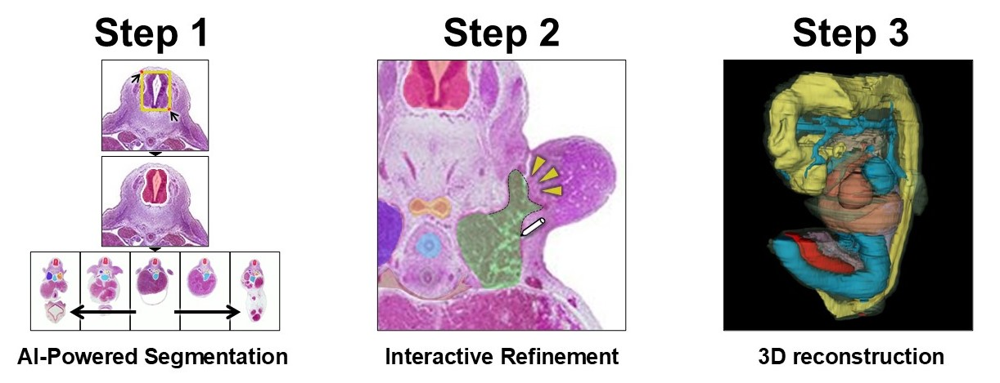
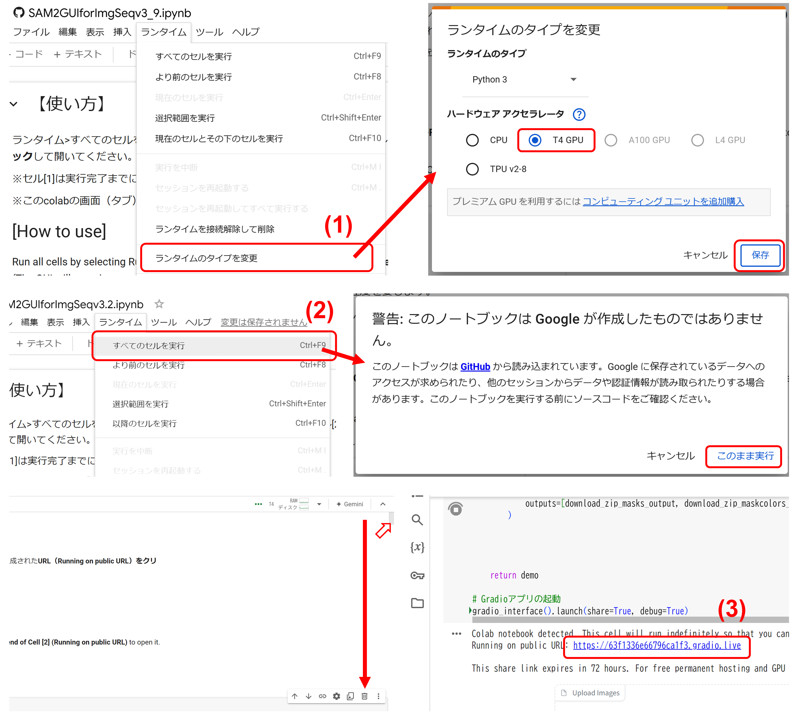
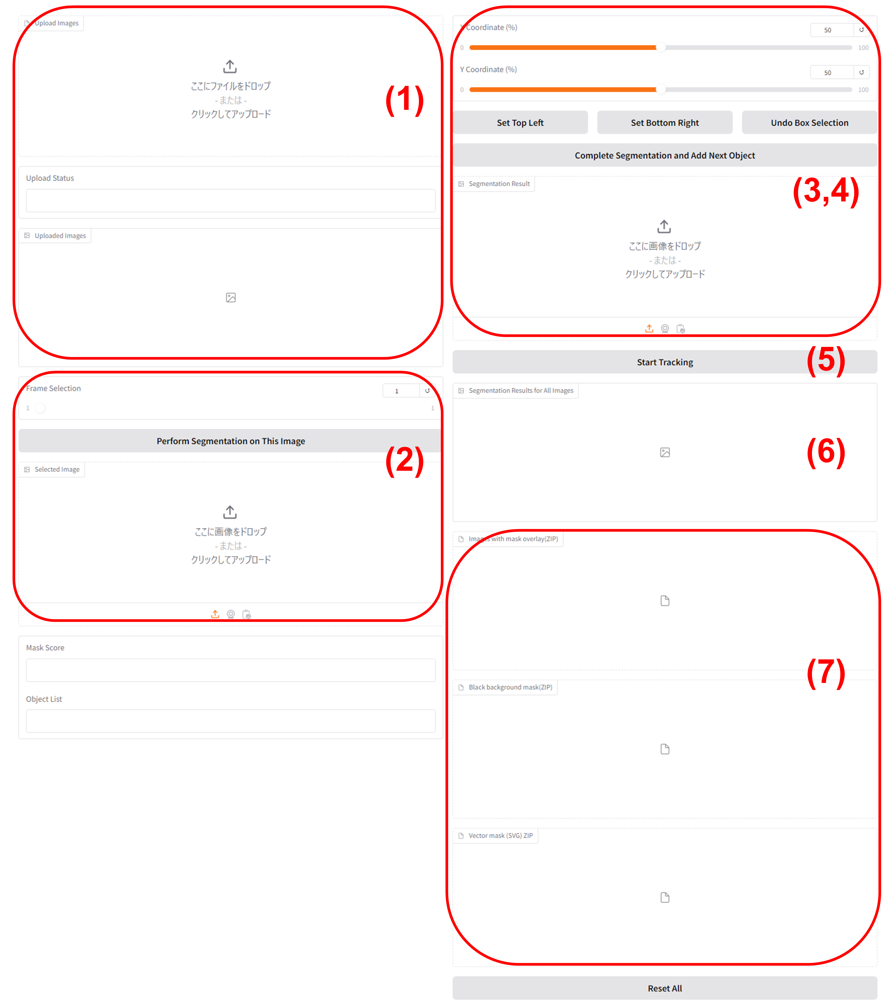
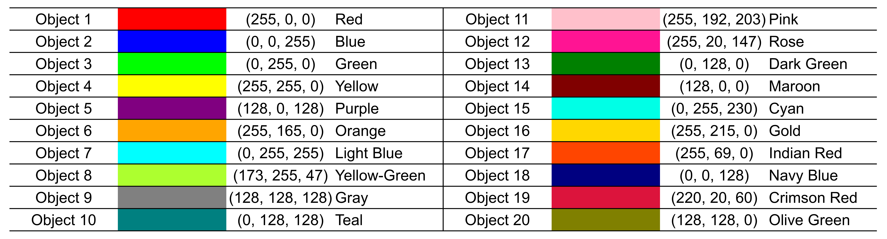
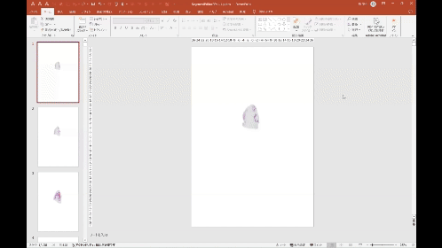
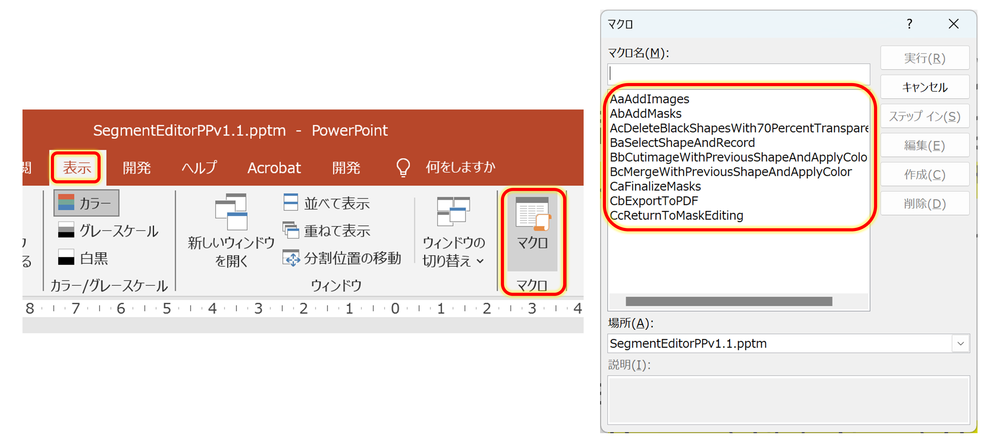
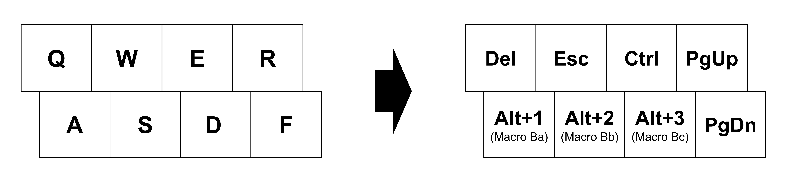
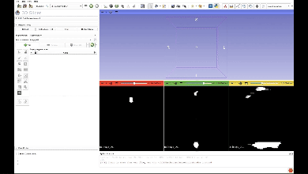
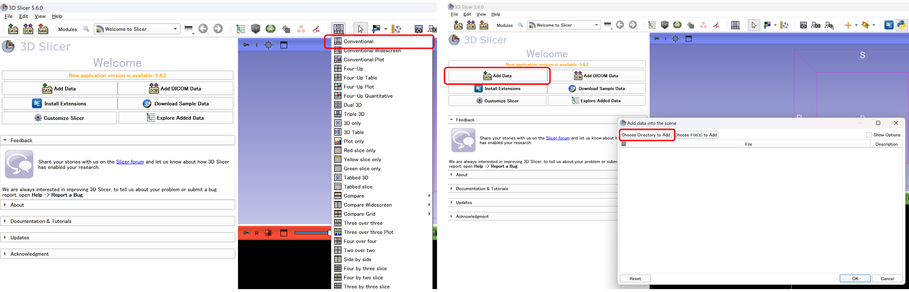
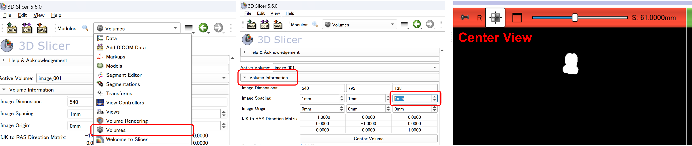

# "Seg & Ref": AI-Powered Segmentation and Interactive Refinement for Labor-Saving 3D Reconstruction  

---

## 🛠 Workflow
🔹 **Step 0. Image Preprocessing (Registration or DICOM Conversion)**
- 🧬 **Histological sections**  →  🔗 [Registration](https://github.com/SatoruMuro/SAM2GUIfor3Drecon/blob/main/Registration.md)
- 🏥 **CT or MRI in DICOM format**  →  🔗 [DICOM Conversion](https://github.com/SatoruMuro/SAM2GUIfor3Drecon/blob/main/toolforDICOM.md)
  
🧠 **Step 1. Seg: AI-Powered Segmentation**  
- 🔗 [SAM2GUIforImgSeq (Colab)](https://colab.research.google.com/github/SatoruMuro/SAM2GUIfor3Drecon/blob/main/ColabNotebooks/SAM2GUIforImgSeqv4_6.ipynb)
  
 🎨 **Step 2. Ref: Interactive Refinement**  
- 🔗 [ColorChanger (Colab)](https://colab.research.google.com/github/SatoruMuro/SAM2GUIfor3Drecon/blob/main/ColabNotebooks/ColorChanger_v1_4.ipynb)  (Optional)  
- 🔗 [SegmentEditorPP](https://github.com/SatoruMuro/SAM2GUIfor3Drecon/releases/tag/ref2.0) (with [Graphic2shape](https://github.com/SatoruMuro/SAM2GUIfor3Drecon/releases/tag/gv1.2))  
  
🧱 **Step 3. 3D Reconstruction**  
- 🔗 [3D Slicer](https://www.slicer.org/)
  


---

# What is "Seg & Ref"?  

**Seg & Ref（セグレフ）**は、3D再構築のための連続断層画像に特化した **Webベースの自動セグメンテーションツール**です。

### 🧠 主な特徴｜Key Features

- 🧩 **連続切片に特化**  
  組織連続切片・解剖断面・CT・MRI・超音波などに対応  
  *Specialized for serial sections including histology, anatomy, CT, MRI, and ultrasound*

- 🤖 **SAM2によるゼロショット自動セグメンテーション**  
  学習不要で対象を自動抽出  
  *Zero-shot segmentation using Segment Anything Model 2 (SAM2), no training needed*

- 💻 **インストール不要のWeb GUI**  
  ブラウザ上で動作、PCへの環境構築不要  
  *Runs entirely in a browser. No local setup required.*

- ✍️ **マスク修正ツール付き**  
  セグメンテーション結果をユーザー自身で確認・修正可能  
  *Includes an interactive correction tool for mask editing*

- 🧱 **3D Slicerとの連携**  
  出力マスクはそのまま3D Slicerで読み込み、迅速な3D再構築が可能  
  *Outputs can be directly imported into 3D Slicer for quick reconstruction*

### ⚠️ 注意｜Notes

- 🧬 **組織連続切片**を使用する場合は、セグメンテーション前に**位置合わせ**が必要です  
　→ 自動位置合わせの方法は 🔗 [こちら（MultiStackReg）](Registration.md)  
　*Histological serial sections require registration before segmentation. See [this page](Registration.md) for details.*

- 🏥 **CTやMRIなどのDICOM画像は、事前にJPEG（.jpg）形式へ変換**しておく必要があります  
　→ DICOM画像からJPEGへの変換ツールは 🔗 [こちら（DICOM Conversion）](toolforDICOM.md)  
　*CT or MRI DICOM images must be converted to .jpg format before use. See [DICOM Conversion](toolforDICOM.md).*

- 🪟 **Step 2で使用する修正ツール**（Segment Editor PP / Graphic2shape）は**Windows専用**です  
　Macなど他のOSでは動作に制限があります  
　*Correction tools used in Step 2 are developed for Windows and may not work on macOS or Linux.*

---

## 🎥 解説・デモ動画（Demo Videos）

### 📘 ツールの紹介｜Introduction to Seg & Ref

<table>
<tr>
<td align="center">
<b>🔹 日本語紹介動画</b><br>
<a href="https://youtu.be/Zs4pfO2FmXE">
  
</a><br>
「Seg & Ref」ツールの概要と使い方（日本語）
</td>
<td align="center">
<b>🔹 English Intro Video</b><br>
<a href="https://youtu.be/rz2QdxfIM9w">
  
</a><br>
Introduction to "Seg & Ref" Segmentation Tool (English)
</td>
</tr>
</table>

### 🛠 操作デモ｜Usage Demonstrations

<table>
<tr>
<td align="center">
<b>🕒 10分で分かる操作デモ｜10-Minute Demo</b><br>
<a href="https://youtu.be/12ihvPAgfps">
  
</a><br>
基本操作をまとめたショートデモ（10分）<br>
Short demonstration covering basic operations (10 min)
</td>
<td align="center">
<b>🎬 フルライブデモ｜Full Live Demonstration</b><br>
<a href="https://youtu.be/-0zrfhaeAX4">
  
</a><br>
操作を実演するライブ収録（フルバージョン）<br>
Full-length live demonstration with step-by-step operation
</td>
</tr>
</table>

---

# 使い方（日本語）

0. 🛠️ Step 0：画像の前処理（位置合わせ・DICOM変換）
   - 🧬 組織切片画像の位置合わせ → [Registration](./Registration.md)
   - 🏥 CT・MRI（DICOM形式）の変換 → [DICOM Conversion](./toolforDICOM.md)

1. 🟢 [Step 1：AIによる自動セグメンテーション](./TutorialJP1.md)
2. ✍️ [Step 2：セグメンテーションマスクの修正](./TutorialJP2.md)
3. 🧱 [Step 3：3D再構築とSTL出力](./TutorialJP3.md)


---

# Tutorial (English)

## Step 1: AI-Powered Segmentation  


Images to Prepare  

Sequential Slice Images (Sequential Tomographic Images)  
JPG format  
JPG Converter
<a href="https://huggingface.co/spaces/SatoruMuro/JPGconverter">
  
</a>  
File names should follow the format: image0001.jpg, image0002.jpg, ...  
Recommended image size: no more than 1000px on each side  
For batch resizing multiple image files, you can use the Image > Scale function in [ImageJ](https://imagej.net/ij/) or the batch conversion feature in [IrfanView](https://www.irfanview.com/) (Windows-only app).  




Launching SAM2 GUI for Image Sequence  
<a href="https://colab.research.google.com/github/SatoruMuro/SAM2GUIfor3Drecon/blob/main/ColabNotebooks/SAM2GUIforImgSeqv4_6.ipynb">

</a>  

Go to Runtime > Run all cells.  
In the warning dialog, select Run Anyway (execution takes approximately 5 minutes).  
Scroll to the bottom of the page.  
Open the URL generated at the end of Cell [2] (displayed as "Running on public URL").  
Note: Do not close the Colab notebook screen after opening the GUI.  



GUI Operation Instructions  

(1) Upload and Verify Files: Upload multiple images and confirm the uploaded files.
(2) Select Image for Segmentation Reference: Choose an image to use as a reference for segmentation.
(3) Segment the First Object: Perform segmentation by specifying the top-left and bottom-right corners of the object. Complete segmentation for the first object.
(4) Segment Additional Objects: Perform segmentation on the next object and complete it. Repeat this process for each object until all target objects are segmented (up to a maximum of 20 objects at once).
(5) Start Tracking: Once segmentation of all objects is complete, initiate tracking.
(6) Verify Segmentation Results: Review the segmentation results.
(7) Download Generated Files: Download the generated files.


Generated Files  

**segmented_images**: Overlaid images of the original and mask images for verification purposes.  
**mask_color_images**: PNG files of RGB-colored mask images for verification purposes.  
**mask_svgs**: SVG files of mask images (vector images) → **To be used in Step 2.**  
**grayscale_masks**: Grayscale mask images in PNG format (used when skipping Step 2 and proceeding directly to Step 3; details provided later).  


Segmentation Color Labels  
  


To reset SAM2 GUI for Img Seq, first, close the Gradio interface. Then, return to the Colab notebook and navigate to Runtime > Disconnect and delete runtime. Finally, re-run all cells by selecting Runtime > Run all.  

  
## Step 2: Interactive Refinement



When Step 1 Automatic Segmentation is Performed Multiple Times　→　Color Label Conversion to Avoid Duplicates　[ColorChanger](https://colab.research.google.com/github/SatoruMuro/SAM2GUIfor3Drecon/blob/main/ColabNotebooks/ColorChanger_v1_4.ipynb)
<a href="https://colab.research.google.com/github/SatoruMuro/SAM2GUIfor3Drecon/blob/main/ColabNotebooks/ColorChanger_v1_4.ipynb">

</a>  

Note: The applications used in Step 2, Segment Editor PP and Graphic2shape, have OS dependencies. Since they are developed for Windows OS, their functionality may be limited or restricted on other operating systems.  

Segmentation Mask Verification and Correction Process  

Download [Segment Editor PP](https://github.com/SatoruMuro/SAM2GUIfor3Drecon/releases/tag/sv1.4) and [Graphic2shape](https://github.com/SatoruMuro/SAM2GUIfor3Drecon/releases/tag/gv1.2).  
Prepare the vector images (SVG files) of the segmentation masks generated in Step 1 (mask_svgs).  
Open the macro-enabled PowerPoint file (pptm) for Segment Editor PP. If macros are disabled, enable them to proceed.  
It is recommended to use a stylus pen, pen tablet, or similar device for the task (mouse operation is also possible).  




Three Groups of 11 Macros Included in Segment Editor PP  
**Group A: Data Input Before Editing**  
**AaAddImages**: Place the image files of sequential tomographic images (select folder).  
**AbAddMasks**: Overlay the vector-converted mask images (in SVG format) onto the sequential tomographic images (select files).  
**AcDeleteBlackShapesWith70PercentTransparent**: Remove unnecessary black backgrounds included in the mask images and set the mask transparency to 70%.  
**Group B: Editing Process**  
**BaSelectShapeAndRecord**: Record the selected mask and make it editable.  
**BbCutimageWithPreviousShapeAndApplyColor**: Trim the mask area based on a freeform or curve tool-drawn outline (subtract).  
**BcMergeWithPreviousShapeAndApplyColor**: Expand the mask area based on a freeform or curve tool-drawn outline (add).  
**Group C: Output After Editing**  
**CaFinalizeMasks**: Hide the background sequential tomographic images and set the mask images to have a black background.  
**CbExportToGrayPNG**: Export as grayscale PNG files → Use the exported files in Step 3.  
**CbExportToPDF**: Export as PDF files.  
**CbExportToPNG**: Export as PNG files.  
**CcReturnToMaskEditing**: Return to the mask editing mode.  


Things to Do First  

**(1) Adjust Slide Size**  
Check the aspect ratio of the pixel size of the sequential tomographic images in the file properties or similar. Adjust the slide’s aspect ratio to match. As long as the width-to-height ratio is the same, it should be fine.  
**(2) Add Macros to the Quick Access Toolbar**  
Place the Group B macros as the first three items on the Quick Access Toolbar. Commands in the Quick Access Toolbar can be accessed with the shortcut "Alt + Number" (the number corresponds to their position in the toolbar).  
**(3) Add Developer tab to Main Tabs**  
Macros can be accessed from either the Developer tab or the View tab. By default, the Developer tab is not displayed in PowerPoint. To add it, follow these steps: File > Options ("PowerPoint Options") > Customize Ribbon > Main Tabs > Developer.  


Data Input Before Editing: Macro Group A  
Note: When running the Group A macro, make sure that PowerPoint is active and displayed as the front-most window.  
Use macros Aa and Ab to place the sequential slice images and mask images.  
To make the mask images placed with macro Ab editable, convert them from graphic format to shapes using [Graphic2shape](https://github.com/SatoruMuro/SAM2GUIfor3Drecon/releases/tag/gv1.2). Launch the Graphic2shape executable file and follow the instructions in the message box. Graphic2shpae is used in combination with macro Ab.  
Use macro Ac to remove the unnecessary black background and set the mask transparency to 70%.  


Editing Process: Macro Group B  
It is recommended to work with a stylus pen or pen tablet, using the stylus (or mouse) in your right hand and the keyboard with your left hand.  
For keyboard operations, consider using the "Key Remapping" feature in [Windows Power Toys](https://github.com/microsoft/PowerToys/releases/tag/v0.85.0) Keyboard Manager to set up a layout optimized for the following tasks.  
Navigate between slides with PgUp and PgDn to review the segmentation results and make edits as needed.  
While selecting a specific mask, use "Ctrl + Mouse Scroll" to zoom in and out.  
Use the Group B macros and freeform input with the stylus (or the Curve Tool if using a mouse) to make fine adjustments to the mask contours.  

Segmentation mask modifications are performed using the Group B macros. The Group B macros consist of:  
    Macro Ba: Declares the target for editing.  
    Macro Bb: Reduces the segmentation mask area.  
    Macro Bc: Expands the segmentation mask area.  
For more efficient editing, consider remapping the Group B macros to easily accessible keyboard shortcuts.  

To use the Group B macros, you must first select a shape before running the macro. Follow these steps:  
1. Select the shape you want to edit and run Macro Ba.  
2. After running Macro Ba, choose the Freeform (Scribble) tool, draw the desired shape, and ensure that the drawn shape remains selected.  
3. With the drawn shape still selected, run Macro Bb to reduce the segmentation mask area or Macro Bc to expand it.  




Output After Editing: Macro Group C  

Once verification and corrections of all segmentation masks are complete, use macro Ca to generate images for output and macro Cb to export the corrected mask images in grayscale.  
Each object corresponds to the following grayscale values: (255, 248, 237, 226, 215, 204, 193, 182, 171, 160, 149, 138, 127, 116, 105, 94, 83, 72, 61, 50)  

The output images are stored in a folder named "edittedmasks", which is saved in the same location as the working Segment Editor PP file.  
If a folder named "edittedmasks" already exists in the save location, it will be overwritten, so caution is required.  

## Step 3: 3D reconstruction  




Here, I introduce a method using the free software [3D Slicer](https://www.slicer.org/). Other software, such as Amira-Avizo or ImageJ, can also be used to import the images generated in Step 2, extract masks using thresholding, and perform 3D reconstruction.  

[Download 3D Slicer](https://www.slicer.org/)  
Determine the pixel size per millimeter (px/mm) in the sequential tomographic images being segmented. This can be calculated by including a scale bar in the images or by measuring the actual size of the specimen.  




Image Import and Scale Adjustment  

Launch 3D Slicer and set the display mode to Conventional from the toolbar.  
Go to Add data > Choose Directory to Add and select the folder containing the mask images (use the grayscale images exported from Segment Editor PP using macro Cb).  



Go to Volumes > Volume Information and adjust the Image Spacing for the z-axis (the order is x-axis, y-axis, and z-axis from left to right).  
For the z-axis Image Spacing, enter the value of (pixel size per mm) × (slice interval in mm). The Image Spacing for the x-axis and y-axis can remain at 1 mm.  
Changing the input values may cause the tomographic image display to shift. Use the Center View button to center the image on the screen.  


Segmentation Mask Extraction and 3D Reconstruction  

Go to the Segment Editor screen and press the Add button.  
Use the Threshold tool, and click and drag within the specific object to select structures with that grayscale value.  
Review the selection area, then press Apply.  
Repeat this process for each object.  
Press the Show 3D button to view the 3D rendering (expand the ▼ on the right to adjust smoothing options).  
Use the Center View button to center the object on the screen.  


Exporting STL Files  

Go to the Segmentations screen and select Export to files to output the STL file.  


3D Data Observation  

Launch 3D Slicer again.  
Set the display mode to 3D only.  
Go to Add data > Choose Files to Add and select all the STL files you created to import them.  
Navigate to the Models screen to change the color and transparency of each node.  
Save the current setup as an MRML Scene to reopen it later in the same state.  


Display Settings and Screenshot Capture Method  

To set the 3D view background to black, go to View controllers > 3D View Controllers, click the eye icon, and select Black background.  
To turn off the cube and label display, go to View controllers > 3D View Controllers, click the eye icon, and uncheck 3D cube and 3D axis label.  
To capture a screenshot, click the camera icon in the top toolbar, select 3D View, specify the destination folder and file name in Save As, and click OK.  


---


# Update  
**2025.4.14**  
Segment Editor PPに一括処理などのマクロを複数追加（SegmentEditorPPv2.0.pptm）

**2025.3.11**  
No module named 'sam2'となるエラーを修正（SAM2GUIforImgSeqv4.6.ipynb）。  

**2025.3.11**  
PyTorch + CUDA + cuDNNの互換性を修正（SAM2GUIforImgSeqv4.3.ipynb）。  

**2025.2.4**  
SAM2 GUI for Img Seqのリセット方法を明記（SAM2GUIforImgSeqv4.2.ipynb）。  
SegmentEditorPPの新しいバージョンを追加(SegmentEditorPP1.4.pptm)。  

**2024.11.19**  
SAM2 GUI for Img Seqの中身をSAM2からSAM2.1にグレードアップさせました（SAM2GUIforImgSeqv4.0.ipynb）。これにより精度向上が期待されます（使用実感としてはあまり変わらないかもです）。  

**2024.10.25**  
Segment Editor PPにグレースケールのマスク画像の出力機能を追加しました（SegmentEditorPPv1.2.pptm）。これにより、3D slicerでのセグメント認識がより簡便になります。Tutorialの記載を更新しました。  

**2024.10.25**  
SAM2 GUI for Img Seqにグレースケールのマスク画像の出力機能を追加しました（SAM2GUIforImgSeqv3.6.ipynb）。これにより、3D slicerでのセグメント認識がより簡便になります。（詳細は後日Tutorialを更新して記載します）  

**2024.10.17**  
SAM2 GUI for Img Seqにベクター化機能（SVGファイル出力機能）を追加しました（SAM2GUIforImgSeqv3.4.ipynb）。これにより、[Vectorizer Colab](https://colab.research.google.com/github/SatoruMuro/SAM2GUIfor3Drecon/blob/main/ColabNotebooks/Vectorizer_v5.ipynb)を用いてベクター変換作業を行う必要がなくなりました。同様にColorChangerにもベクター化機能を追加しました（ColorChanger_v1.3.ipynb）。  

---

# Link of tools  
JPG Converter: [HuggingFace](https://huggingface.co/spaces/SatoruMuro/JPGconverter),[GoogleColab](https://colab.research.google.com/github/SatoruMuro/SAM2GUIfor3Drecon/blob/main/ColabNotebooks/JPGconverter_v1_1.ipynb)  
SAM2 GUI for Img Seq: [HuggingFace](https://huggingface.co/spaces/SatoruMuro/SAM2GUIforImgSeq)(*Low-precision model running slowly on CPU), [GoogleColab](https://colab.research.google.com/github/SatoruMuro/SAM2GUIfor3Drecon/blob/main/ColabNotebooks/SAM2GUIforImgSeqv4_6.ipynb)(*High-power model running on GPU, this is recommended) , [GoogleColab(previous version](https://colab.research.google.com/github/SatoruMuro/SAM2GUIfor3Drecon/blob/main/ColabNotebooks/SAM2GUIforImgSeqv3_9.ipynb)   
Color Changer: [HuggingFace](https://huggingface.co/spaces/SatoruMuro/ColorChanger), [GoogleColab](https://colab.research.google.com/github/SatoruMuro/SAM2GUIfor3Drecon/blob/main/ColabNotebooks/ColorChanger_v1_4.ipynb)  
Object Mask Splitter: [GoogleColab](https://colab.research.google.com/github/SatoruMuro/SAM2GUIfor3Drecon/blob/main/ColabNotebooks/ObjectMaskSplitterv2_5.ipynb) , [GoogleColab(new ver)](https://colab.research.google.com/github/SatoruMuro/SAM2GUIfor3Drecon/blob/main/ColabNotebooks/ObjectMaskSplitterv2_8.ipynb)   

---

# License
The code for the JPG Converter, SAM2  for Img Seq, ColorChanger, Vectorizer Colab, Segment Editor PP, Graphic2shape, and Object Mask Splitter is licensed under the [Apache 2.0 License](https://github.com/SatoruMuro/SAM2for3Drecon/blob/main/LICENSE).

---

## 📚 Citation

### 🔖 ご利用の際の引用について（日本語）

本ツールを研究・論文等で使用される場合は、以下の論文を引用してください：

**Muro S, Ibara T, Nimura A, Akita K.**  
**Seg & Ref: A Newly Developed Toolset for Artificial Intelligence-Powered Segmentation and Interactive Refinement for Labor-Saving Three-Dimensional Reconstruction.**  
*Microscopy (Oxford)*. (in press)  
🔗 [DOI: 10.1093/jmicro/dfaf015](https://academic.oup.com/jmicro/advance-article/doi/10.1093/jmicro/dfaf015/8051094?utm_source=authortollfreelink&utm_campaign=jmicro&utm_medium=email&guestAccessKey=d61820c6-f079-42aa-b81c-767f36f8d455)

---

### 🔖 Citation (for international users)

If you use this tool for research or academic purposes, please cite the following article:

**Muro S, Ibara T, Nimura A, Akita K.**  
**Seg & Ref: A Newly Developed Toolset for Artificial Intelligence-Powered Segmentation and Interactive Refinement for Labor-Saving Three-Dimensional Reconstruction.**  
*Microscopy (Oxford)*. (in press)  
🔗 [DOI: 10.1093/jmicro/dfaf015](https://academic.oup.com/jmicro/advance-article/doi/10.1093/jmicro/dfaf015/8051094?utm_source=authortollfreelink&utm_campaign=jmicro&utm_medium=email&guestAccessKey=d61820c6-f079-42aa-b81c-767f36f8d455)

---

### 📎 BibTeX

```bibtex
@article{Muro2025,
  author    = {Muro, Satoru and Ibara, T. and Nimura, A. and Akita, K.},
  title     = {Seg \& Ref: A Newly Developed Toolset for Artificial Intelligence-Powered Segmentation and Interactive Refinement for Labor-Saving Three-Dimensional Reconstruction},
  journal   = {Microscopy (Oxford)},
  year      = {in press},
  doi       = {10.1093/jmicro/dfaf015}
}


# Citation
本ツールを研究などに使用した場合は、以下の論文を引用してください。  
If you use this tool for research or other academic purposes, please cite the following article:

Muro S, Ibara T, Nimura A, Akita K.  
Seg & Ref: A Newly Developed Toolset for Artificial Intelligence-Powered Segmentation and Interactive Refinement for Labor-Saving Three-Dimensional Reconstruction.  
*Microscopy (Oxford)*. (in press)  
DOI: [10.1093/jmicro/dfaf015](https://academic.oup.com/jmicro/advance-article/doi/10.1093/jmicro/dfaf015/8051094?utm_source=authortollfreelink&utm_campaign=jmicro&utm_medium=email&guestAccessKey=d61820c6-f079-42aa-b81c-767f36f8d455)

```bibtex
@article{Muro2025,
  author    = {Muro, Satoru and Ibara, T. and Nimura, A. and Akita, K.},
  title     = {Seg \& Ref: A Newly Developed Toolset for Artificial Intelligence-Powered Segmentation and Interactive Refinement for Labor-Saving Three-Dimensional Reconstruction},
  journal   = {Microscopy (Oxford)},
  year      = {in press},
  doi       = {10.1093/jmicro/dfaf015}
}
