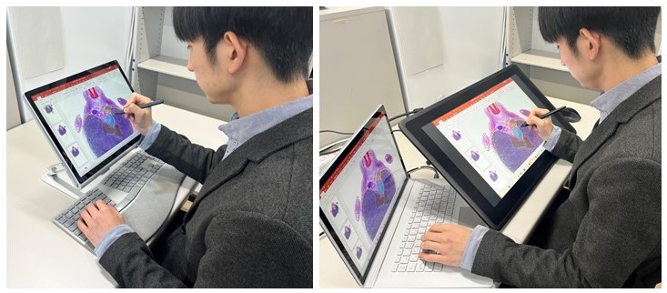
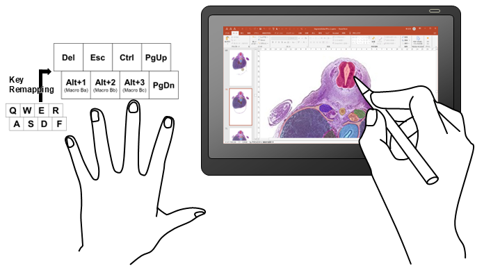

# Seg&Refの使い方 - Step 2

## セグメンテーションマスクの修正

---

### ⚠️ 注意事項
**Segment Editor PP** および **Graphic2shape** は **Windows専用**です。他のOS（Mac/Linux）では動作に制限があります。

---

### 🧠 セグメンテーションを複数回行った方へ

自動セグメンテーション（Step 1）を複数回行った場合、**ラベルの重複を防ぐ**ために、以下のカラーツールでラベルを再整理してください：

🔗 [ColorChanger（Colab）](https://colab.research.google.com/github/SatoruMuro/SAM2GUIfor3Drecon/blob/main/ColabNotebooks/ColorChanger_v1_4.ipynb)  

---

### 🛠 使用するツール

- 🔽 [Segment Editor PP](https://github.com/SatoruMuro/SAM2GUIfor3Drecon/releases/tag/ref2.0)（PowerPoint マクロ対応）
- 🔽 [Graphic2shape](https://github.com/SatoruMuro/SAM2GUIfor3Drecon/releases/tag/gv1.2)（図形変換ツール）
- 🔁 入力するマスクファイル：Step 1で出力された `mask_svgs`（SVGファイル）

---

### ✅ 作業開始前にやること（初期設定）

**(1) マクロを有効にする（pptmファイル）**  
ダウンロードした `.pptm` ファイル（Segment Editor PP）は、初回実行時にマクロが無効化されていることがあります。以下の手順でマクロを有効にしてください（Windows）：

1. ファイルを**右クリック**して「**プロパティ**」を選択  
2. 「全般」タブの下部に表示される  
　`□ 許可する（このファイルは他のコンピューターから取得したものです）` にチェックを入れる  
3. 「OK」をクリック  
4. PowerPoint でファイルを開き、「**コンテンツの有効化**」をクリックしてマクロを有効にする

**(2) スライドサイズの調整**  
連続断層画像のピクセルサイズのアスペクト比（幅：高さ）をファイルのプロパティ等で確認し、スライドのアスペクト比をそれに合わせる（幅と高さの比率が同じになればOK）。

**(3) クイックアクセスツールバーにマクロを追加**  
Bグループのマクロ（Ba / Bb / Bc）は、よく使うためクイックアクセスツールバーに登録しておくと便利です。

🔧 手順：

1. PowerPoint ウィンドウの左上にあるクイックアクセスツールバーの「▼」をクリック  
2. 「**その他のコマンド**」を選択  
3. 「コマンドの選択」で `マクロ` を選ぶ  
4. `BaSelectShapeAndRecord`, `BbCutimageWithPreviousShapeAndApplyColor`, `BcMergeWithPreviousShapeAndApplyColor` をそれぞれ選択して「追加」  
5. 上下のボタンを操作して、上から順に並ぶように配置する
6. 「OK」で確定

💡 配置した順番に応じて、`Alt + 数字キー` のショートカットで簡単にマクロを呼び出せます。

**(4) 「開発」タブの表示**  
マクロは「開発」または「表示」タブから実行できます。PowerPointの初期設定では「開発」タブは非表示なので、以下の手順で表示します：  
`ファイル > オプション > リボンのユーザー設定 > メインタブ > 開発` にチェックを入れてください。

**(5) 作業姿勢と環境のセッティング**  
修正作業は、以下のような作業環境が推奨されます：

- タッチ対応PC（例：Microsoft Surface Book）＋Surfaceペン  
　　または  
- 外付けペンタブレット（例：Wacom Cintiq 22）＋キーボード  

基本的な作業姿勢は以下の通りです：

- **右手でペン操作、左手でキーボード操作**（ショートカット操作）を推奨  
- **左利きの場合は逆でもOK**  

💡 この姿勢により、片手でマスク修正、もう片手でマクロ実行やスライド移動がスムーズに行えます。

**(6) キー配置の最適化（PowerToysの使用）**  
[Windows PowerToys](https://github.com/microsoft/PowerToys/releases/tag/v0.85.0) の `Keyboard Manager` を使用して、ショートカットキーの割り当てをカスタマイズすると、左手のキーボード操作がしやすくなります。

💡 たとえば、以下のように割り当てると快適です：  

| 機能                     | もとのキー        | 割り当て先       |
|--------------------------|-------------------|------------------------|
| マクロBa（対象を記録）   | Alt + 1           | A                     |
| マクロBb（マスクを削る） | Alt + 2           | S                     |
| マクロBc（マスクを広げる）| Alt + 3           | D                     |
| スライド戻る             | PgUp              | R                     |
| スライド進む             | PgDn              | F                     |
| Ctrl（拡大縮小用）       | Ctrl              | E                     |
| 削除                     | Delete            | Q                     |
| Esc（選択解除など）      | Esc               | W                     |

🖋 **このようなキー配置では：**
- **人差し指** → スライドの切り替え（`PgUp` / `PgDn`）  
- **中指** → `Ctrl` キーを押しながら  
- **反対の手でマウススクロール** → 拡大・縮小操作  
がスムーズに行えます。

🔁 **マクロ操作（Ba/Bb/Bc）についてはこのあと解説します。**

---

### 🗂 マクロ構成と作業手順（Segment Editor PP）

---

#### 🔷 グループA：編集前のデータ入力

| マクロ名 | 機能 |
|----------|------|
| `AaAddImages` | 元画像（連続断層画像）をスライドに一括配置（1スライド1画像） |
| `AbAddMasks` | SVG形式のマスク画像を対応するスライド上に重ねて配置 |
| `AcDeleteBlackShapesWith70PercentTransparent` | 不要な黒背景を削除し、マスクを70%透過に設定 |

---

#### 📝 作業手順：グループAマクロの使用

1. PowerPointのウィンドウを**最前面**にしておく  
2. **マクロ `AaAddImages` を実行**：セグメンテーションを行う元画像（組織切片やCT画像）（例：image0001.jpg ～）が置かれているフォルダを選択  
   - 1枚ごとにスライドへ自動配置され、スライド数と画像数が一致する状態になります  
3. **マクロ `AbAddMasks` を実行**：Step 1で出力した `mask_svgs` フォルダを選択（個々のファイル名：mask0001.svg ～）  
   - 各スライド上の元画像に対応して、SVGマスクが上に重ねられます（mask0001等のファイル名で対応場所を検出します）  

4. SVGマスクはPowerPoint上でそのままでは**編集できません**  
   - マクロ `Ab` 実行直後に、[**Graphic2shape**](https://github.com/SatoruMuro/SAM2GUIfor3Drecon/releases/tag/gv1.2)（Windows専用）を起動  
   - ダイアログの指示に従い、変換対象のスライド数を入力  
   - 各スライド上のSVGが自動的に**図形（Shape）に変換**され、編集可能になります
     ⚠️ 自動変換中はマウスやキーボード操作はできません（バックグラウンド動作非対応）  

5. **マクロ `AcDeleteBlackShapesWith70PercentTransparent` を実行**：  
   - マスク画像に含まれていた黒背景を削除  
   - 各マスクを70%の透過に設定し、元画像が見える状態になります  

✅ この状態で、**マスクが半透明に重なった状態で表示・編集可能**となり、次の「グループB：編集作業」へ進めます。

---

#### 🖊 グループB：編集作業（マスクの微修正）

| マクロ名 | 機能 |
|----------|------|
| `BaSelectShapeAndRecord` | 編集対象となるマスクを記録（選択状態に） |
| `BbCutimageWithPreviousShapeAndApplyColor` | 描画図形を使ってマスクを削る（減算） |
| `BcMergeWithPreviousShapeAndApplyColor` | 描画図形を使ってマスクを広げる（加算） |

---

#### 📝 作業手順：グループBマクロの使用

1. 編集したいマスク（図形）をクリックして選択  
2. マクロ `BaSelectShapeAndRecord` を実行（このマスクが編集対象になります）  
3. PowerPointの「描画」ツールから **フリーフォーム（Scribble）** または **曲線ツール（Curve）** を選択  
4. 増減させたいマスクの形状をなぞるように描く（※描いた図形が選択されたままにしておく）  
5. 以下のいずれかを実行：  
   - `Bb` を実行 → マスク範囲を削る（減算）  
   - `Bc` を実行 → マスク範囲を広げる（加算）

🔧 編集の効率化のために：
- よく使うマクロ（Ba, Bb, Bc）はクイックアクセスツールバーに追加し、`Alt + 数字キー` で呼び出すのがおすすめ
- [Windows PowerToys](https://github.com/microsoft/PowerToys/releases/tag/v0.85.0) の「Keyboard Manager」でショートカットキーを再配置して、左手操作を最適化
- スライド移動には `PgUp`, `PgDn` キーを使用すると便利
- 編集作業には **タッチペンやペンタブレット（例：Wacom Cintiq）** の使用を推奨

---

#### 💾 グループC：編集後の出力

| マクロ名 | 機能 |
|----------|------|
| `CaFinalizeMasks` | 背景を非表示にし、マスクだけの画像に変換 |
| `CbExportToGrayPNG` | グレースケールPNGとして出力（→ Step 3で使用） |
| `CbExportToPNG` | RGBカラーマスクをPNG形式で出力 |
| `CcReturnToMaskEditing` | マスク編集モードに戻す（再編集したい場合） |

---

#### 📝 作業手順：グループCマクロの使用

1. すべてのマスク修正が完了したら、マクロ `CaFinalizeMasks` を実行  
   - 背景画像（連続断層画像）を非表示にし、黒背景上にマスクのみが残る状態にします  
2. 続いて、マクロ `CbExportToGrayPNG` を実行  
   - グレースケールPNGファイルとしてエクスポート  
   - ダイアログが表示されるので、画像サイズ（例：378 × 613 px）を入力  
   - グレースケール画像は **3D Slicerでのセグメント抽出（Step 3）** に使用可能

📌 オブジェクトごとのグレースケールラベル値：  
`255, 248, 237, 226, 215, 204, 193, 182, 171, 160, 149, 138, 127, 116, 105, 94, 83, 72, 61, 50`

💡 RGBベースの抽出を行う他ソフトを使用する場合は、マクロ `CbExportToPNG` を使ってカラー画像として出力してください。  
💡 マスク編集をやり直したい場合は、マクロ `CcReturnToMaskEditing` を実行すれば再編集が可能です。

---

#### 💾 出力ファイルの保存先と注意点

- 出力ファイルは、pptmファイルと同じフォルダ内に `edittedmasks` という名前のフォルダとして自動生成されます  
- すでに同名フォルダがある場合は**上書き保存される**ので、必要に応じて事前にバックアップを取ってください

---

### 💡 保存先と注意点

- 出力ファイルは `edittedmasks` フォルダに保存されます（Segment Editor PP と同じディレクトリに作成）  
- 既に `edittedmasks` が存在する場合は **上書きされる**ので注意

---

### ▶️ 次のステップへ進む 🔗

- 👉 [Step 3：3D再構築と解析はこちら](./README_Step3.md)

---
