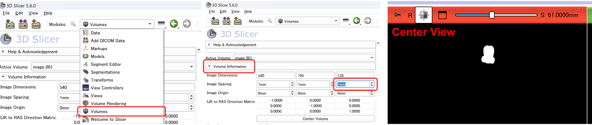

# Seg&Refの使い方 - Step 3

## 3D再構築

このステップでは、無料ソフトウェア [3D Slicer](https://www.slicer.org/) を使って、Step 2 で修正したマスク画像から3Dモデルを構築します。  
Amira-Avizo や ImageJ などの他ソフトでも、**グレースケールマスク**を使って同様の処理が可能です。

---

### 🔧 事前準備

- 🔗 [3D Slicerのダウンロードはこちら](https://www.slicer.org/)
- 使用した切片画像の **実寸スケール（px/mm）** を求めておく  
　（画像内にスケールバーを写す／標本サイズを測るなど）

---

### 🗂 1. マスク画像の読み込みとスケール調整

1. 3D Slicer を起動  
2. 画面上部メニューから表示モードを **"Conventional"** に設定  
3. `Add Data > Choose Directory to Add` を選択し、  
　**Step 2 で出力されたグレースケールマスク（mask_gray_png）** のフォルダを選択して読み込み  
4. `Volumes > Volume Information` に進み、**Image Spacing** を修正  
　- 左から順に：`X軸`, `Y軸`, `Z軸`  
　- `Z軸` に入力する値：  
　　**px/mm × 切片の間隔（mm）**  
　　（例：2.96 px/mm × 0.2 mm = 0.592）  
💡 `X軸` と `Y軸` の spacing は通常そのまま（1.0）でOK  
💡 `X軸`, `Y軸`, `Z軸` 値の比を維持すれば数値は変更可能（実寸や10倍スケールなど、もとの標本サイズに応じて扱いやすい大きさにすればよい）  
💡 表示がずれた場合は、`Center View` ボタンで中央に表示を調整

---

### 🧱 2. セグメントマスクの抽出と3D構築

1. `Segment Editor` モジュールに切り替える  
2. `Add` ボタンでセグメントを追加  
3. `Threshold` を選択し、画像上で対象物をクリック＆ドラッグ  
　→ 該当のグレースケール値の構造物を選択  
4. 範囲を確認し `Apply` をクリック  
5. 他のオブジェクトも同様に繰り返し追加  
6. `Show 3D` ボタンを押すと、3D像が表示される  
　（右の▼から Smoothing のON/OFFも切り替え可能）  
7. 表示がずれていたら `Center View` で中央に戻す

---

### 💾 3. STLファイルの出力

1. `Segmentations` モジュールに切り替える  
2. `Export to files` を選択  
3. STL形式で保存する（ファイルごとに分割されます）

---

### 🔍 4. 3Dデータの表示

1. 新たに 3D Slicer を立ち上げる  
2. 表示を `3D only` に変更  
3. `Add Data > Choose Files to Add` で、保存したSTLファイルを全て読み込む（ドラッグ＆ドロップでも読み込み可） 
4. `Models` モジュールに切り替え、各オブジェクトの**色・透明度**を調整  
5. `Save` を押し、MRML Scene（プロジェクトファイル）として保存  
　→ 後から同じ状態を再現可能！

---

### 🎨 5. 表示設定・スクリーンショットの取得

- 背景を黒にする：  
　`View Controllers > 3D View Controllers > Eye icon > Black background`

- キューブやラベル表示をオフ：  
　`View Controllers > 3D View Controllers > Eye icon`  
　→ `3D cube` と `3D axis label` のチェックを外す

- スクリーンショットの撮影方法：  
　1. ツールバーのカメラアイコンをクリック  
　2. `3D View` を選択  
　3. `Save As` で保存場所とファイル名を指定 → `OK`

---
